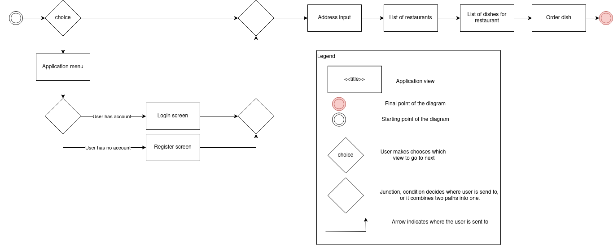
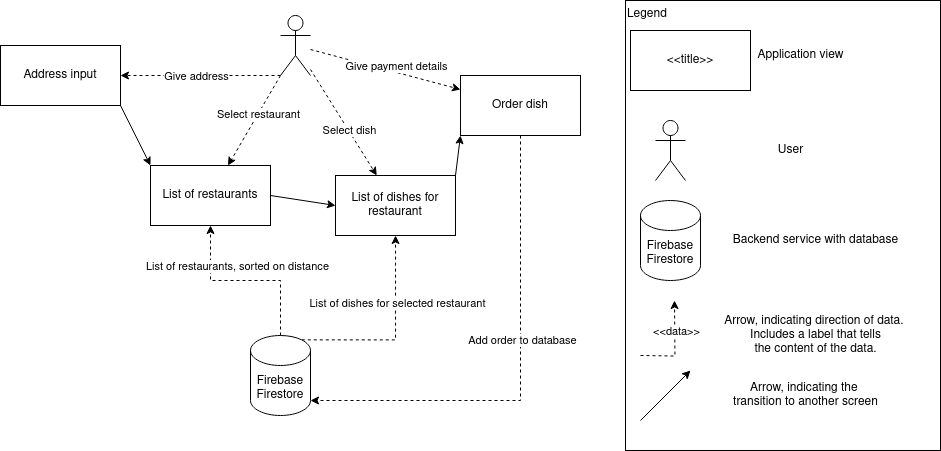

# Architecture

This document contains design information about the application.
The requirements, decisions and current progress information are documented here alongside some useful diagrams. 

This document assumes you know the terminology from [clean architecture.](https://medium.com/@kamal.lakhani56/clean-architecture-f23b7d9c6ee7)

## Functional requirements
- Application must find nearest restaurants for the users (Unimplmented)
- Users must be asked for their address (Implemented)
- App must show a list of restaurants to the user (Implemented)
- User must be able to filter restaurants based on food categories (Work in progress)
- User must be able to see the dishes that a restaurant servers (Implemented).
- User must be able to order the dishes from a restaurant (Unimplemented)
- The app must provide it's text in English and Dutch (Implemented)

## Quality requirements
- App must be responsive, it must be usable by both mobile and desktop screens. (Implemented)
- User must be able to quickly figure out how to start the primary action of the application, which is searching for restaurants and ordering food. (Work in progress)
- List of restaurants must load within 1 second for users with a stable 4G or wifi connection. (Implemented)
- The codebase must be easiliy maintainable, for example: it must be easy to swap the database for a different database or it should be easy to change the themecolors of the application. (Work in progress, see [Codebase maintainability](#codebase-maintainability))

## Flow diagram

## Data view

## Codebase maintainability
The [clean architecture](https://medium.com/@kamal.lakhani56/clean-architecture-f23b7d9c6ee7) model was chosen as a architecture for this codebase. And the [Flutter Bloc](https://pub.dev/packages/flutter_bloc) library is used for statemanagement.

### Flutter Bloc
The reason for choosing Flutter Bloc is that it is very easy to add or remove states and events to the state of the application widgets.
This is also one of the more popular state management approaches in large flutter applications.

### Clean architecture.
The idea behind clean architecture is that it is easy to change parts of the codebase without touching other parts of the code. This is because every level of the application is isolated.

This means that is should be very easy to change the api calls or the database connection classes without having to change a single thing in the view level. This is also one of the quality requirements, and since this is the architecture model that I am most familiar with, I choose this model.
However, I am not an expert in this model and some parts of the codebase should be changed in the future.

- The repositories in the catalog feature get a reference from the datasource and then perform the query, but I figured out that the datasource should perform the query, not the repositories, this should be changed in the future.
- I have seen people use abstract classes for the repositories, datasource and usecases. I created a single abstract class for each and put them in the shared directory, however this causes problems when using these abstract classes in different features where return types are not always the same. Instead, every feature should have it's own abstract repository, datasource and usecase class or no abstract class at all.

